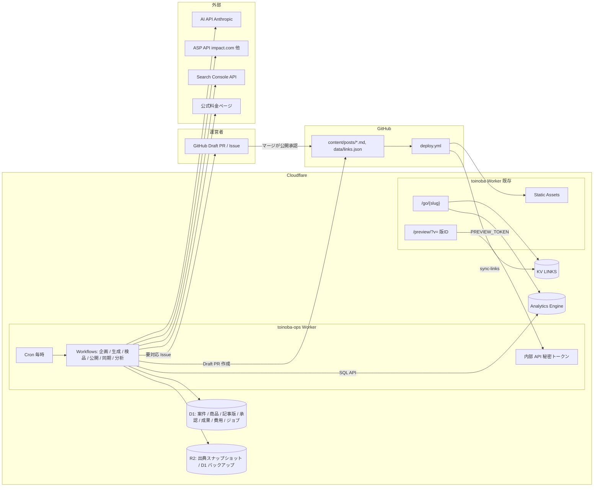
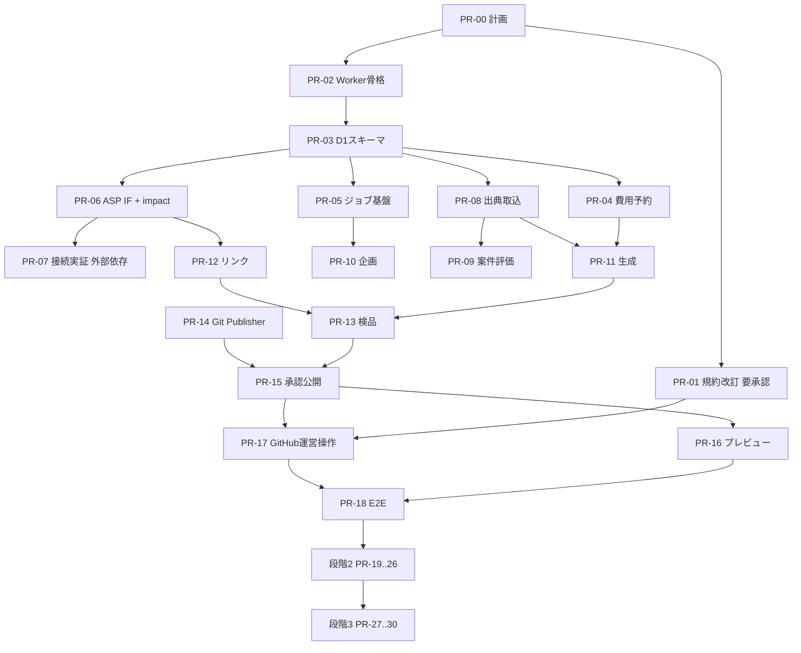

# 11. 自動化運用 実装計画

`docs/09-automation-requirements.md`（要件定義書 v1.0）を満たすための実装計画。
既存機能との対応は `docs/10-automation-requirements-map.md`（A01）を参照。
`docs/06-development-plan.md` の Phase 1〜5 は完了済みであり、本計画はその続き（段階0〜3）を扱う。

規模は日数ではなく、変更対象のコンポーネントと依存関係で表す。

## 1. 前提

- **1 PR = 1 タスク**（`AGENTS.md`）。以下の PR 一覧は独立してマージできる粒度に分割している
- `docs/10` の要確認事項は運営者が仮前提を承認済み。**R1 は運営画面なし（GitHub Draft PR / Issue で代替）に確定**。R5 は `AGENTS.md` を「公開は運営者の明示操作でのみ行う」に改訂する
- 公開サイト（`src/`、`wrangler.jsonc`）の変更は最小限にする（B02, T16）。既存の記事 URL・`/go/`・デプロイ CI は変更しない
- 外部接続（ASP・AI・GSC）の資格が未入手でも、モックコネクターで共通機能の実装と試験を進める。モック接続を実接続完了とは扱わない（§1）

## 2. アーキテクチャ

公開サイト Worker（`toinoba`）には手を入れず、運営系を別 Worker（`toinoba-ops`）に分離する。
停止・障害・予算超過が公開サイトに波及しない（N05）ことと、認証境界を明確にする（N01）ことが理由。



### 主要な設計判断

| 項目 | 決定 | 理由・代替案 |
|---|---|---|
| 実行環境 | Cloudflare Workers（`worker/ops/`）+ Workflows + Cron Triggers | A03 の候補どおり。GitHub Actions はデプロイ専用に維持し、有料処理は Workflows の `step.do` で工程単位に永続化（A04）。実行環境を混在させず費用・履歴を D1 に一元化 |
| 契約プラン | Workers Paid（$5/月）を予算計上 | Free は CPU 10ms／サブリクエスト50／Cron 5本／Workflows 状態保持3日（公式 Limits、2026-09-12 確認）。AI 応答の検証や HTML 検品で 10ms を超える可能性が高い。**現プランは外部依存として確認（R6）** |
| 構造化データ | D1（SQLite） | 既存 DB がない。金額は整数（最小通貨単位）、原IDに一意制約（D06）。Free 枠内で足りるが Paid でも追加費用なし |
| 成果物・バックアップ | R2 | 出典スナップショット（F08）と D1 日次エクスポート（N06）。既存の画像用バケットとは別プレフィックス |
| 認証 | 運営 UI は GitHub。ops Worker の HTTP は `OPS_TRIGGER_SECRET`、プレビューは `PREVIEW_TOKEN` | 独自ログイン・Access・運営画面は作らない（R1 確定）。ユーザー登録機能は作らない |
| 運営操作 | Draft PR（承認／差分／検品）と Issue（今日の操作・要対応・週次） | §10 の画面要件は GitHub で代替。設定変更は `data/ops-settings.json` の PR |
| 記事入稿（PublisherAdapter） | 第1実装 = Git（`content/posts/**.md` + `data/links.json` を GitHub API でコミット） | 現状 `CONTENT_SOURCE=local` で稼働。版 = コミット SHA、復元 = 旧版内容の再コミット、費用 0。microCMS 実装は段階3（R8）。トークンは fine-grained PAT（`contents:write` のみ、`workflows` なし）。`deploy.yml` に「ops bot のコミットは `content/` と `data/links.json` 以外を変更していない」ガードを追加（N07） |
| 公開完了の判定 | コミット SHA → Actions 実行成功 → 公開 URL の `<meta name="toinoba:version">` が版IDと一致 | F24「公開URLと版を確認して初めて公開済み」。版IDは frontmatter の任意フィールド `versionId` で出力（既存記事は未設定でよい） |
| プレビュー | `/preview/?v={版ID}&token=` で ops の版データを取得。トークン未設定・不一致は 401 | F21 の表示確認は Draft PR 差分を主、プレビューを補助。既存の microCMS `?id=&draftKey=` は残す |
| HTML 安全化 | Workers 組込みの `HTMLRewriter` による許可リスト型サニタイズ | 新規ライブラリなし。本文は Markdown で保持し、生 HTML は `<table>` 系のみ許可 |
| スケジュール | Cron は `0 * * * *`（毎時）1本。D1 の `schedules` テーブル（Asia/Tokyo）で実行判定 | O01「時刻は画面で変更できる」。再デプロイ不要。停止中の分は直近1回のみ実行 |
| リンクの正本 | D1 `affiliate_links` → 公開時に `data/links.json` を生成してコミット → 既存 `sync-links` が KV へ | `docs/01`「KV を手編集しない」を維持（R7）。`/go/` の実装は変更しない |
| テスト | `vitest` + `@cloudflare/vitest-pool-workers`（追加理由を PR-02 に記載） | `docs/06` T8 で想定済み。D1 マイグレーションと Workflows をローカルで検証 |

## 3. データモデル（D1）

`worker/ops/migrations/0001_init.sql` から番号付きで管理する（`wrangler d1 migrations`）。
金額列は `*_minor`（整数、最小通貨単位）と `currency` の組で持つ。

| 要件 | テーブル | 主なキー・制約 |
|---|---|---|
| D01 | `programs`, `program_capabilities` | `UNIQUE(network, external_id)`。状態 `candidate / researching / applying / applied / approved / operable / held / ended`。確認期限 `verify_by` |
| D02 | `products`, `plans`, `sources`, `claims`, `claim_articles` | `sources` は URL・取得日時・抜粋ハッシュ・R2 キー・取得状態。`claims` は情報版 `info_version` を持つ |
| D03 | `topics`, `articles`, `article_versions`, `generation_runs` | `article_versions` に `body_hash`、`info_version_set`、`link_version`、`status`。`generation_runs` にプロンプト・モデル・トークン・費用 |
| D04 | `affiliate_links`, `link_placements`, `approvals` | `approvals` は `(article_id, version_id, body_hash, info_version_set, link_version, approver, approved_at)`。承認後に対象が変われば `invalidated_at` を立てる |
| D05 | `click_aggregates`, `conversions`, `search_metrics`, `sync_states` | `conversions` は `UNIQUE(network, raw_id)`。元状態 `raw_status` と正規化 `status`（pending / approved / rejected / reversed / paid）。購入者情報は列を作らない |
| D06 | `jobs`, `job_steps`, `cost_ledger`, `cost_reservations`, `audit_events` | `cost_reservations` は `(job_id, kind, reserved_minor, settled_minor, state)`。`audit_events` は操作主体・対象・前後の値 |
| 設定 | `settings`, `schedules`, `notifications`, `retention_policies` | B05 の初期値（週2本・修正2件・承認待ち5件）、O01 の時刻、F20 の鮮度、F33 の閾値 |

### 記事状態機械（F23）

`draft → collecting → generating → reviewing → (needs_fix | awaiting_approval) → approved → publishing → published`
分岐: `held`, `rejected`, `failed`。公開済み記事の更新は新しい `article_versions` 行で進め、`published_version_id` は承認後の公開完了時にだけ更新する。

### 費用予約（O04〜O06）

1. 有料処理の開始前に上限費用（最大出力トークン × 単価 × 安全率 + 検索回数 + 再試行分）を計算する
2. `UPDATE cost_ledger SET reserved_minor = reserved_minor + ? WHERE month = ? AND fixed_minor + spent_minor + reserved_minor + reserve_buffer_minor + ? <= cap_minor` を実行し、更新行数 0 なら開始しない（並行予約でも超過しない）
3. 処理完了時に実費で精算し、差額を解放する。80% で通知、90% で新規生成・拡張調査を停止する
4. 1記事の予約上限は 200 円。超える見積りは `held` にする

## 4. ディレクトリ構成（新規分）

```
worker/ops/
├── wrangler.jsonc            # D1 / R2 / KV(LINKS 読取) / Workflows / Cron
├── migrations/               # D1 マイグレーション
├── src/
│   ├── index.ts              # fetch（内部 API）/ scheduled（Cron）
│   ├── auth/trigger.ts       # OPS_TRIGGER_SECRET / PREVIEW_TOKEN 検証
│   ├── db/                   # 型付きクエリ（any 禁止）
│   ├── budget/               # 予約・精算・上限判定
│   ├── jobs/                 # Job 永続化・再試行分類
│   ├── workflows/            # plan / generate / review / publish / sync / analyze
│   ├── connectors/
│   │   ├── asp/              # AspConnector IF, impact.ts, mock.ts, （partnerstack.ts 未実装スタブ）
│   │   ├── ai/               # AiProvider IF, anthropic.ts
│   │   ├── search/           # SearchProvider IF, gsc.ts
│   │   └── publisher/        # PublisherAdapter IF, git.ts, （microcms.ts 段階3）
│   ├── fetcher/              # 許可ドメイン・SSRF 防止・robots 尊重・スナップショット
│   ├── review/               # 検品ルール群
│   ├── pricing/              # F07 正規化・計算
│   ├── sanitize/             # 許可リスト型 HTML サニタイズ
│   └── notify/               # GitHub Issue 作成
└── test/
.github/workflows/deploy-ops.yml
.github/workflows/backup-d1.yml
```

公開サイト側の変更は `src/pages/preview/index.astro`（版ID対応）、`src/content.config.ts`（任意 `versionId`）、`src/components/seo/SeoHead.astro`（version meta）、`deploy.yml`（ops bot ガード）に限定する。

## 5. PR 分割

各 PR の説明に、対応要件IDと `docs/09` §14 の受入試験項目をチェックリストとしてコピーする。
共通の完了条件: `npx astro check` エラーなし、`npm run build` 成功、`worker/ops` の `vitest` 成功、秘匿値・生成物をコミットしない。

### 段階0: 既存調査と接続実証

| PR | 内容 | 主な変更 | 要件 | 試験 |
|---|---|---|---|---|
| PR-00 | 本計画・要件対応表 | `docs/09` `docs/10` `docs/11` | A01 | — |
| PR-01 | 規約改訂 | `AGENTS.md` を「公開は運営者の明示操作でのみ行う」に改訂。管理画面は作らない方針を維持。`docs/00` 非目標も同期 | R1, R5 | — |
| PR-02 | 運営 Worker 骨格 | `worker/ops/` 雛形、`wrangler.jsonc`（D1・R2・Workflows・Cron・`--env staging`）、内部 API の秘密トークン検証、`/healthz`、自動化停止スイッチ、`deploy-ops.yml`、`node:test` | A03, N01, N05 | T14（未認証拒否） |
| PR-03 | D1 スキーマ初版 | `migrations/0001_init.sql`（§3 の全テーブル）、型付きクエリ層、設定初期値（B05, O01, F20, F33）、保持期間 | D01〜D06, B05 | マイグレーション適用・ロールバック試験 |
| PR-04 | 費用台帳と予約 | `budget/`、単価表（モデル・為替・安全率・確認日時）、80%/90% 判定、固定費・予備費500円 | O04〜O08, B03 | T12（並行予約で超過しない） |
| PR-05 | ジョブ基盤 | `jobs/`、Workflow 基底（工程永続化・冪等キー・再試行分類・要対応分類）、Cron → `schedules` 判定 | O01〜O03, A04 | T08, T13 |
| PR-06 | ASP コネクター共通IF + impact.com 実装 + モック | `connectors/asp/`、Capability マトリクス（確認済み／未確認／非対応）、PartnerStack・バリューコマースは未実装スタブと理由 | F02, A05, §12 | T01（モック）。実接続は外部依存 |
| PR-07 | 接続実証レポート | 実アカウントでの認証・案件取得・正式リンク取得・成果一覧（空でも可）の結果を `docs/12-connection-matrix.md` に記録 | 段階0 完了条件 | 外部依存（アカウント・提携承認） |

### 段階1: 記事の承認公開

| PR | 内容 | 主な変更 | 要件 | 試験 |
|---|---|---|---|---|
| PR-08 | 案件・商品・出典の取り込み | `fetcher/`（許可ドメイン・HTTPS・プライベートIP拒否・robots・頻度）、`sources` スナップショット（R2）、`claims` 構造化、`pricing/`（人数別・年払総額・通貨・換算日） | F01, F06〜F09, N02 | T02（取得失敗で価格をゼロにしない、年払総額一致） |
| PR-09 | 案件評価と採用承認 | 候補評価（推測／実測を分離）、8状態の状態機械と確認期限、採用ガード（F03） | F03〜F06 | T01（未提携・地域不一致・リンク自動取得不可は運用可能にならない） |
| PR-10 | 週次企画 Workflow | `workflows/plan.ts`、最大10候補→週2本、`cannibalization.ts` のロジックを共有モジュール化して重複判定、`topicTemplate` 5種別を3記事型へマップ | F10〜F12 | T03（初期データ空でも企画可、同一検索意図は重複扱い） |
| PR-11 | 記事生成 Workflow | `connectors/ai/anthropic.ts`、zod 構造化出力（タイトル・見出し・本文・比較表・向く人／向かない人・注意点・出典・確認日・商品IDと挿入位置）、`generation_runs` 記録、`firsthand` = `pricing/` の計算結果（R2） | F13〜F16, A05 | T03, T04 |
| PR-12 | リンク管理 | `affiliate_links` / `link_placements`、正式 URL の取得（コネクター経由）、`data/links.json` 生成器、記事識別IDは `subIdParam` 確認済みの案件のみ | F16, F17, D04 | T04（紹介IDを保持、識別IDは対応 ASP だけ） |
| PR-13 | 検品器 | `review/`（必須項目・根拠対応・数値再計算・鮮度・誇張／創作禁止語・広告条件・リンク検証・重複・HTML 安全性・見出し構造）。`lint-content.ts` の語彙を共有モジュールへ | F15, F19, F20, N02 | T03, T05 |
| PR-14 | PublisherAdapter（Git） | `connectors/publisher/git.ts`（GitHub Git Data API でコミット、状態照会、旧版復元）、公開サイト側 `versionId` meta、`deploy.yml` ops bot ガード | A02, F24, F26, N07 | T07, T16（既存 URL 維持） |
| PR-15 | 承認と公開 Workflow | `approvals` ハッシュひも付け・失効判定、公開キーによる冪等化、公開先状態照会からの再開、権限検証 | F22〜F24, F26 | T06, T07, T08 |
| PR-16 | プレビュー | `/preview/?v=&token=`、内部リンク候補を公開済みに限定 | F18, F21, N01 | T05, T14 |
| PR-17 | GitHub 運営操作 | Draft PR 本文に要約・出典・検品・案件・価格・推定費用・差分。ラベルで修正依頼／保留／却下。Issue で今日の操作と要対応 | §10, F21 | T05, T14 |
| PR-18 | 1記事 E2E と定期実行有効化 | 検証環境で1記事を通し、火・金 08:00 JST の生成スケジュールを有効化。承認待ち5件で停止 | 段階1 完了条件, O02 | T13, T17（実接続は外部依存） |

### 段階2: 運用全体の自動化

| PR | 内容 | 主な変更 | 要件 | 試験 |
|---|---|---|---|---|
| PR-19 | 成果同期 Workflow | `workflows/sync.ts`（ページング・カーソル・90日再照合・JST 変換・原ID一意 upsert・状態正規化）、`sync_states`、Postback/Webhook は署名検証 + 照合前は仮扱い | F27〜F30, N03 | T10 |
| PR-20 | クリック集計と検索指標 | Analytics Engine SQL API → `click_aggregates`（ボット除外の定義を明記）、`connectors/search/gsc.ts`（`gsc-report.ts` のロジックを Worker 向けに移植、WebCrypto で JWT 署名） | F27, F11, D05 | T10（欠損は欠損として表示） |
| PR-21 | KPI・週次レポート | EPC（分母ゼロは未算出、原通貨保持）、前期間差、データ充足度、次の行動3件、方向転換抑制（28日／100クリック） | F31〜F33 | T11 |
| PR-22 | 改善提案と修正版 | `workflows/improve.ts`（企画・タイトル・比較表・説明不足・料金更新）、新版を承認待ちへ、版と変更日で追跡 | F34 | T07 |
| PR-23 | 料金変更・案件終了の検知 | 影響記事の特定、修正版またはリンク撤去案、緊急通知、運営者の一括停止操作（`data/links.json` の `active:false` を承認とは別にコミット）、監査記録 | F25 | T09 |
| PR-24 | 通知 | 画面内通知（要対応4種のみ）、週次まとめ、外部通知は設定済み宛先のみ | O09 | T13 |
| PR-25 | バックアップと復旧 | `backup-d1.yml`（日次 `wrangler d1 export` → R2）、復元手順・試験、DB 移行前バックアップ、接続再認証手順 | N05, N06 | T15 |
| PR-26 | 設定と履歴の Git 面 | `data/ops-settings.json`、実行ログの Issue 添付、接続状態・予算を週次 Issue に含める | §10, B05, O01 | — |

### 段階3: 安定化と拡張準備

| PR | 内容 | 要件 |
|---|---|---|
| PR-27 | 実測費用の反映と月額予測、7日運転レポート（未観察項目は保留と明記） | O07, T18 |
| PR-28 | 3〜5商品の運用可能化（案件承認に依存）、追加 ASP コネクター（採用案件次第） | 段階3 |
| PR-29 | microCMS PublisherAdapter（R8 の確認後。任意） | A02 |
| PR-30 | 運営者向け手順書（初期設定・通常運用・停止・復旧）、環境変数一覧、未解決事項一覧 | §13 納品物 |

## 6. 依存関係



PR-02〜PR-06 と PR-08 は互いに独立して並行できる。PR-07 は運営者のアカウント準備が前提で、他の PR をブロックしない。

## 7. 月額費用試算（継続運用）

1 USD = 150 円で仮換算。為替・単価は PR-04 の単価表で確認日時付きに管理し、実請求で更新する。

| 項目 | 月額（円） | 根拠 |
|---|---|---|
| Cloudflare Workers Paid | 750 | $5/月。Workflows・D1・KV・R2・Analytics Engine は同プランの含有量内（R6） |
| Cloudflare Access | 0 | 使わない（運営画面なし） |
| ドメイン更新（`toinoba.com`） | 約 170 | 年額の月割り。実額は運営者に確認 |
| AI API（Anthropic） | 約 1,000 | 生成 週2本 + 修正 週2件 ≒ 月16回 × 約40円、企画・検品補助 約300円。1記事の予約上限 200 円 |
| GitHub Actions | 0 | 公開リポジトリ |
| microCMS Hobby | 0 | 未使用（Git 入稿） |
| Search Console API | 0 | 無料 |
| 予備費 | 500 | O04 の初期値 |
| **合計** | **約 2,400** | 上限 5,000 円に対し約 2,600 円の余裕 |

初期開発用 AI（Cursor 等）の費用は別枠であり、この台帳に含めない（B03）。
無料枠や予算の自動増額は行わない（O06）。

## 8. 外部依存（運営者に依頼する事項）

コード調査と接続時に必要になったものだけ列挙する。未入手でも独立した PR は進める。

| 項目 | 必要になる PR | 入力先 |
|---|---|---|
| Cloudflare 契約プラン（Free / Paid）の確認、Paid への変更可否 | PR-02 | — |
| ops Worker 用の `OPS_TRIGGER_SECRET` / `PREVIEW_TOKEN` | PR-02 | `wrangler secret` |
| D1・R2（ops 用）の作成、`wrangler.jsonc` の ID | PR-02, PR-03 | GitHub Variables |
| GitHub fine-grained PAT（`contents:write`, `actions:read`。`workflows` なし） | PR-14 | `wrangler secret`（`GITHUB_CONTENT_TOKEN`） |
| Anthropic API キーと利用上限設定 | PR-11 | `wrangler secret`（`ANTHROPIC_API_KEY`） |
| impact.com のアカウント・紹介者 API 資格・提携承認 | PR-06, PR-07 | `wrangler secret` |
| Search Console プロパティの読み取り権限（既存 `GSC_SERVICE_ACCOUNT_JSON` を流用） | PR-20 | `wrangler secret` |
| 既存固定費（ドメイン更新費など）の実額 | PR-04 | コンソールの設定画面 |
| 初回案件の採用承認、対象業務課題の確定 | PR-09 以降 | コンソール |
| 外部通知先（必要な場合のみ） | PR-24 | コンソール |

秘匿値はチャットに貼らず、`wrangler secret` / GitHub Secrets / Cloudflare ダッシュボードに入力する。

## 9. 受入試験と証跡の出し方

- 各 PR に `docs/09` §14 の対応する試験（T01〜T18）をチェックリストで含め、`vitest` の結果とローカル `wrangler dev` のログを PR 説明に添付する
- 実接続を要する試験（T01 実案件、T10 実成果、T17、T18）は、資格が未入手なら「外部依存で未検証」と記載し、モック結果と区別する
- 完了報告は「実装完了」「実接続確認済み」「外部依存で未検証」の3区分で行う（§15）

## 10. 納品物と対応

| 納品物（§13） | 場所 |
|---|---|
| ソースコード | `worker/ops/`、公開サイト側の最小変更 |
| DB スキーマと移行手順 | `worker/ops/migrations/`、`docs/13-ops-runbook.md`（PR-30） |
| 環境変数一覧（秘匿値なし） | `worker/ops/.dev.vars.example`、README |
| 設定初期値 | `migrations/0002_settings_seed.sql` |
| 既存機能対応表 | `docs/10-automation-requirements-map.md` |
| 接続機能マトリクス | `docs/12-connection-matrix.md`（PR-07） |
| テストと結果 | `worker/ops/test/`、各 PR 説明 |
| 月額費用試算 | 本書 §7 → コンソールの費用画面（実測で更新） |
| 運営手順（初期設定・通常運用・停止・復旧） | `docs/13-ops-runbook.md`（PR-30） |
| 未解決事項一覧 | `docs/10` 要確認事項 + PR-30 で更新 |
